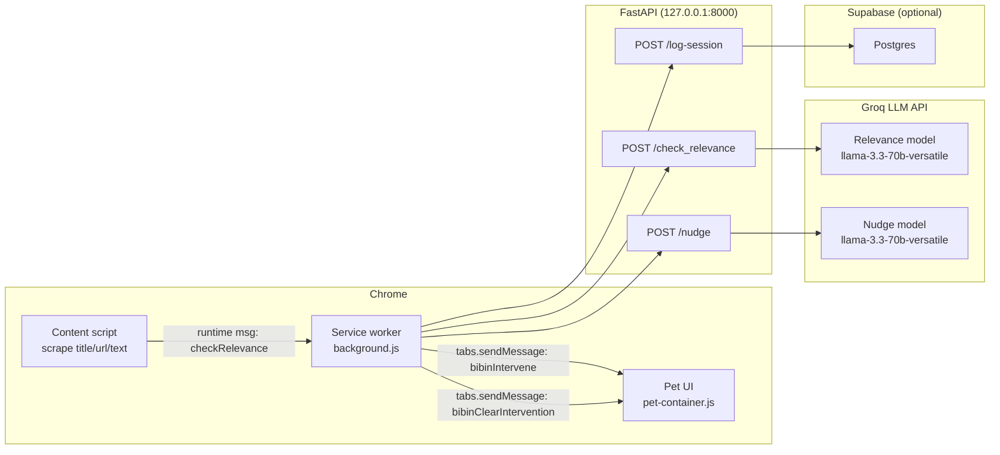

# Bibintell

Bibintell is a Chrome extension + local backend that turns “stay focused” into an end‑to‑end system:

- You start a study session (topic + duration).
- The extension continuously evaluates each page you visit against that topic.
- When you drift, Bibin (the on-page assistant) intervenes with a one‑sentence nudge.
- If you stay on the distracting page, nudges repeat every 10 seconds and escalate from playful to stern using session metrics.

This repo is intentionally built like a product prototype: observable, stateful, and designed around a real workflow instead of a demo script.

## What’s in this repo

- **Chrome Extension (Manifest V3)**: captures context, tracks session state, shows the pet UI, and orchestrates interventions.
- **FastAPI backend**: exposes `/check_relevance`, `/nudge`, and session logging endpoints.
- **LLM reasoning (Groq)**: one model evaluates relevance; one model generates nudges.
- **Supabase (optional)**: stores session summaries for the stats dashboard.

## Quick demo (60 seconds)

1. Start the backend.
2. Load the extension unpacked in Chrome.
3. Summon Bibin → choose a study subject → choose a duration.
4. Visit a relevant page: Bibin stays quiet.
5. Visit an irrelevant page: Bibin intervenes.
6. Stay on that page: nudges repeat every ~10s, getting firmer.

## System architecture



## How it works (actual runtime workflow)

### 1) Starting a study session

1. On browser startup/installation (or via the popup), the service worker asks the active tab to show Bibin.
2. The pet UI runs a short flow:
   - “Ready to start working?”
   - user enters `studySubject`
   - user enters `studyDuration`
3. The pet UI writes session state to extension storage:
   - `chrome.storage.local.set({ studySubject })`
   - `chrome.storage.local.set({ studyDuration, studyActive: true })`
4. The service worker observes `studyActive` and initializes session metrics:
   - `studySessionStartTime`
   - `sessionInterventions`
   - `sessionTotalPages` / `sessionRelevantPages`
   - `sessionDistractionSites`

### 2) Page monitoring (content → service worker)

The content script runs on all pages and detects navigation changes (history events, focus, title mutation, URL polling). On each “meaningful change” it:

- extracts:
  - `title` (document title)
  - `url` (window location)
  - `content` (first 1000 chars of `document.body.innerText`)
- sends a runtime message to the service worker:
  - `action: "checkRelevance"`

### 3) Relevance decision (service worker → backend)

When the service worker receives `checkRelevance`:

1. It first verifies session state: `studyActive === true` and a non-empty `studySubject`.
2. It increments `sessionTotalPages`.
3. It calls the backend:

```http
POST http://127.0.0.1:8000/check_relevance
{ "topic": "…", "title": "…", "content": "…", "url": "…" }
```

The backend uses `ai_engine/reasoning_agent.py` to ask the LLM for a strict JSON verdict:

- `relevant: boolean`
- `reason: "1–2 sentence justification"`

If relevant:
- the service worker increments `sessionRelevantPages`
- and clears any active intervention on that tab.

If not relevant:
- the service worker starts a per-tab intervention loop.

### 4) Intervention loop (repeat + escalation)

For an off-task page, the service worker starts a per-tab loop (see `INTERVENTION_REPEAT_MS = 10000`):

- Immediately dispatches one intervention
- Then repeats every 10 seconds while the user stays on the same page and the study session is still active

Each tick:

1. The service worker builds an intervention prompt containing:
   - study topic
   - current page title + URL
   - reason from `/check_relevance`
   - session metrics (elapsed minutes, focus %, interventions so far)
   - reminder count for the same page
   - a tone target that escalates with reminder count
2. It calls:

```http
POST http://127.0.0.1:8000/nudge
{ "prompt": "…" }
```

3. The backend generates a one-sentence nudge via `BibinModel.generate_nudge()`.
4. The service worker sends the result to the tab UI:
   - `action: "bibinIntervene"`
   - `nudge: "…"`

The loop stops automatically when any of these occur:

- the tab navigates to a different URL
- the page becomes relevant again
- the user ends the study session
- the tab is closed
- the service worker sends a clear-intervention message

### 5) Session end + stats

A session can end when:

- the countdown timer expires, or
- the user clicks “End session” in the popup.

On end, the service worker posts a session summary to the backend:

```http
POST http://127.0.0.1:8000/log-session
{
  "subject": "…",
  "intended_duration_mins": 60,
  "actual_duration_mins": 52,
  "interventions": 4,
  "distraction_sites": ["reddit.com"],
  "total_pages": 31,
  "relevant_pages": 22
}
```

The stats UI reads:

- `GET /user-stats`
- `GET /session-history`

## Running locally (Windows)

### Prerequisites

- Python 3.10+ recommended
- Chrome (or Chromium)
- A Groq API key

### 1) Backend setup

From the repo root:

```powershell
python -m venv .venv
.\.venv\Scripts\Activate.ps1
pip install -r requirements.txt
```

Create `.env` (in repo root or `ai_conversation/`) with:

```env
GROQ_API_KEY=your_key_here
```

Run the API:

```powershell
python -m uvicorn ai_conversation.main:app --reload --host 127.0.0.1 --port 8000
```

Open `http://127.0.0.1:8000/debug_status` to confirm the backend is alive.

Important: CORS is locked to a single extension ID. Update `EXTENSION_ID` in [ai_conversation/main.py](ai_conversation/main.py) to match your unpacked extension’s ID.

### 2) Load the extension

1. Open `chrome://extensions`
2. Enable **Developer mode**
3. Click **Load unpacked**
4. Select the `bibintell-extension/` folder

### 3) Start a session

- Click the extension icon → “Summon Bibin”
- Enter a subject and duration
- Browse as normal; Bibin intervenes only when `/check_relevance` returns `relevant: false`

## Debugging and observability

This project is built to be debuggable.

- **Service worker logs**: `chrome://extensions` → Bibintell → “Service worker” → Inspect
  - Logs are prefixed with `[BibinDebug]` and include milestone events like:
    - `intervention_pipeline_triggered`
    - `intervention_pipeline_prompt_ready`
    - `intervention_nudge_call_start`
    - `intervention_nudge_endpoint_ok`
    - `intervention_pipeline_dispatched`
- **Debugger UI**: the extension includes a debugger page that reads a rolling event log stored in `chrome.storage.local`.
- **Backend terminal logs**:
  - `/check_relevance` prints `[CHECK] …`
  - `/nudge` prints `[NUDGE] …`

## Privacy and security notes

- The extension requests `<all_urls>` because it must observe navigation/content to evaluate relevance.
- During an active session, the first 1000 characters of page text are sent to the local backend.
- The backend uses the Groq API for relevance classification and nudge generation; that means page snippets may be processed by a third-party LLM provider.
- Session logging stores summaries (counts and site hostnames), not raw page content.

If you want a fully offline mode, the architecture supports it, but you would swap the LLM provider for a local model and remove external calls.

## Repo structure

- `bibintell-extension/` — Chrome extension
  - `background/background.js` — orchestration + timers + backend calls + intervention loop
  - `content/content.js` — scraping + route change detection
  - `pet/pet-container.js` — on-page UI + session start flow + displays nudges
  - `popup/` — quick actions (summon / end session)
  - `stats/` — session dashboard UI
  - `debugger/` — event timeline UI
  - `store/` — prototype “lumber” shop UI
- `ai_conversation/` — FastAPI app and LLM wrapper
  - `main.py` — endpoints + Supabase logging
  - `bibin_model.py` — Groq client + system prompts
- `ai_engine/` — relevance reasoning
  - `reasoning_agent.py` — LLM-based relevance classifier

## Product direction (why this is different)

Most focus tools enforce rules. Bibintell focuses on:

- **intent alignment** (topic-aware, not a URL blocklist)
- **measured interventions** (only when the model says you’re off-task)
- **behavior feedback loops** (metrics in the prompt so nudges evolve during the session)
- **operational correctness** (service worker orchestrates state, retries messaging, and logs milestones)

## Roadmap ideas

- Make CORS + Supabase config environment-driven (production-safe defaults)
- Add a “why I flagged this” expandable explanation in the UI
- Personalization: calibrate strictness per user and per subject
- Evaluation harness: replay browsing traces and measure false positives/negatives
